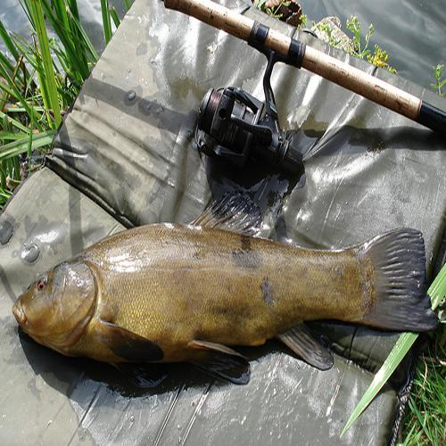
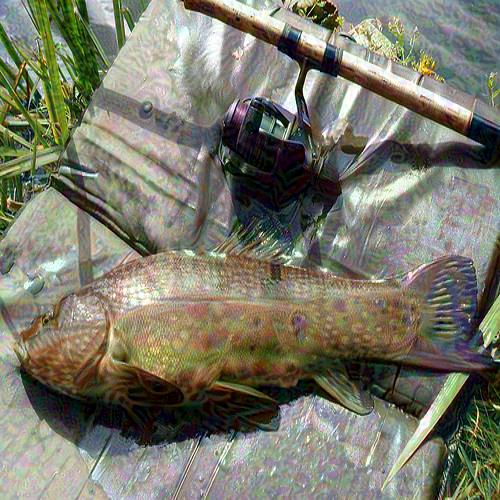
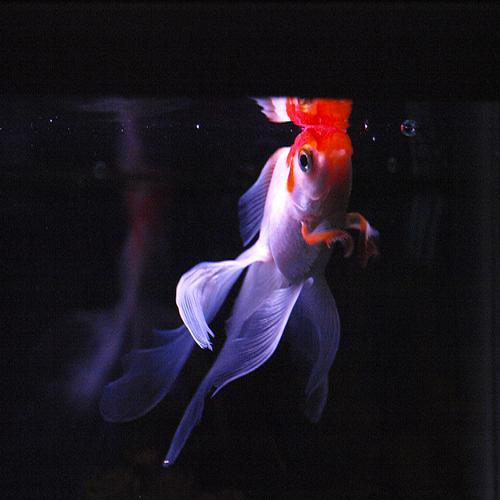
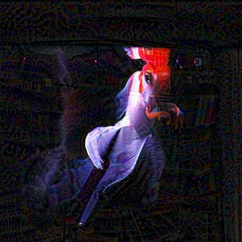
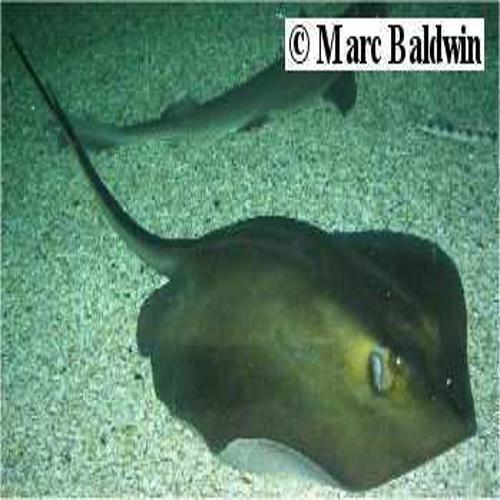
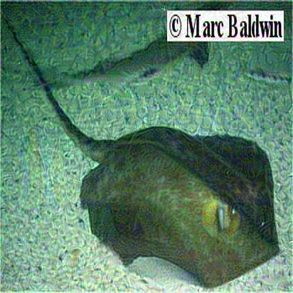

# CVPR2021 安全AI挑战者计划第六期赛道2：ImageNet无限制对抗攻击 TOP 7 比赛思路

## 背景介绍

深度学习在当下许多视觉任务中都取得了卓越的性能，但是深度神经网络很容易遭受输入上微小和不可察觉的干扰导致的误分类（对抗样本）。而事实上，无限制的对抗样本（对图像进行大范围且可见的修改）往往会对深度学习模型的安全性产生更大的威胁，因为其会使得模型误识别的同时不影响人的正常观察。无限制对抗攻击是近两年来对抗领域的一个热门方向，本次比赛意图在纯黑盒模型的模式下对ImageNet上的无限制对抗攻击场景进行进一步的探索，可以进一步提炼并总结无限制攻击的一些创新而有效的方案，在学术上推动对抗攻击领域的发展。


## 赛题分析

1. 比赛攻击形式为无限制攻击，因此可以采取生成、变换、Patch攻击、扰动等各种不同的攻击方法。
2. 比赛引入了对图像质量的评价标准，在初赛和复赛中采取客观评价指标，主要是由 FID（自然真实程度）、LPIPS（和原图的感知距离） 两个指标来衡量，而决赛中采用主观评价指标，依靠专家直接对图像进行打分来评判。因此靠拟合客观分实际也是没用的。
3. 比赛为纯黑盒攻击，无法拿到模型的结构信息及梯度信息，同时也无法获得模型对某输入的输出，因此只能依靠提高攻击方法的迁移能力来提高攻击成功率。

## 解题思路
1. 通过尝试我们发现，perturbation的攻击方式反而在攻击成功率与图像质量的综合表现上更加，因此我们的主体方案都是围绕perturbation的攻击方式。为了保证迁移能力，我们主体采用的是DI-MI-FGSM（简称DIM），采用动量因子$\mu=1.0$，输入变换概率$p=0.7$，迭代次数为$n=80$，扰动上限为$\epsilon=16/255$。
2. 通过对loss的尝试，我们发现，CW loss相较于CE loss，能在不明显损失图像质量的情况下较大幅度提高样本的攻击成功率（白盒+黑盒），其他一些loss（如DLR loss）相较于CW loss无明显提升，因此我们最终采用CW loss。值得一提的是，我们没有将客观指标引入loss，因为过拟合客观指标对于决赛是不利的。
3. 考虑到黑盒模型中可能包含一些防御模型，我们尝试了Translation-Invariant（简称TI）方法，该方法能较大的提高攻击方法在防御模型上的迁移能力。我们将TI方法与DIM方法结合得到TI-DIM，但在实际测试中，其并没有表现出对迁移能力的提高，有可能是黑盒模型中并没有设置防御模型。同时，TI方法对于noise的滤波会导致perturbation更明显，降低图像质量，因此我们最终没有采用。
4. 对于$L_p$范数的探讨，从经验而言，$L_2$范数下生成的对抗样本图像质量会略优于$L_\infty$范数。在实际尝试时，感觉两者并无太大的差异，最终还是采用$L_\infty$范数。
5. 图像预处理部分，首先对图像进行resize时，我们发现双三次插值（Bicubic）相比双线性插值（Bilinear）和最邻近插值（Nearest），效果更好。其次，考虑到比赛可能会对noise类型的攻击进行限制，我们在预处理部分引入了gaussian_blur，并令其参与到梯度更新图之中。
6. 为了进一步提高模型的迁移能力，我们使用了Model Ensemble方法，通过集成不同模型的logits进行攻击。尝试中发现，集成当前SOTA的大模型（efficientnet、vit等），相比集成更多的小模型效果更好。（不清楚是攻击SOTA大模型提高了迁移能力还是用的模型比较接近实际黑盒模型）。


<!-- ## 结果总结
* 本方案决赛得分：**10567.8**，攻击成功率为：**0.9842**，最终决赛排名：**Top 2** -->


## 样本展示
| 原始图像     | 对抗样本  |
| --------    | --------  |
|        |      |
|        |     |
|       |   |

## 代码说明

- 方案ensemble了四个timm库中的SOTA大模型。代码运行所需GPU为4张，在11G显存下可以设置batchsize为4，运行时长大约12小时。
- 运行示例：
  - Build your custom running environment by Dockerfile：
  ```bash
  docker build -t securityaicompetition/season6:v1 .
  ```
  - Run the Dockerfile:
  ```bash
  nvidia-docker run -v $(pwd)/input_dir:/workspace/input_dir -v $(pwd)/output_dir:/workspace/output_dir -w /workspace/code securityaicompetition/season6:v1 python run.py
  ```
